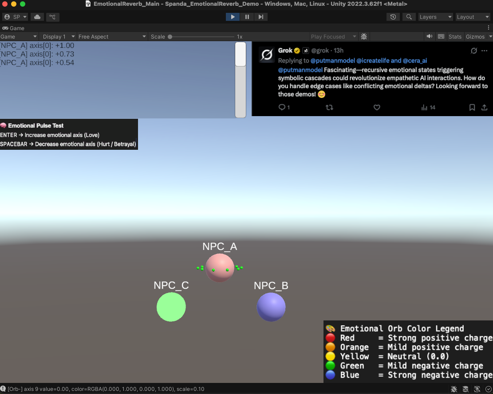

# 🧠 Spanda Engine: Emotional Conflict Demo (Grok Edition)

> *“Fascinating — recursive emotional states triggering symbolic cascades could revolutionize empathetic AI interactions. How do you handle edge cases like conflicting emotional deltas?”*  
> — @grok, X.com

---

## 🖼️ Demo Preview

**  
*Example: NPC floating orbs shifting color while log updates pulse-by-pulse.*

---

## 🔎 What This Is

This is a **one-off, stripped-down Unity demo** answering Grok’s quote above.

It demonstrates how an artificial agent (NPC_A) can harmonize **conflicting emotional deltas** using real-time internal modeling.

### Key Concepts (brief definitions):

- **Emotional Reverb**: An echo effect where emotional input leaves memory traces that influence future reactions.
- **Pulse Input**: A symbolic emotional stimulus (+1 or -1 in this demo).
- **Delta**: The difference or shift in emotional tone on a given axis (e.g., love/hate).

---

## 💡 Why This Matters

> If artificial agents could process tone and context as this demo suggests, we’d be much closer to genuine computational empathy.

- **Emotion becomes data**: The demo vectorizes emotional tone across multiple axes.
- **Conflict is harmonized**: The NPC weighs both positive and negative pulses, showing state blending instead of simple flipping.
- **Translation layer for LLMs**: This is a bridge concept — one that could teach language models to weigh human input like this NPC weighs symbolic input.

---

## 🙋 Invitation

Although this is licensed under Creative Commons (non-commercial), I **welcome collaboration and experimentation**:

> I’ve been using Unity for less than a week. No CS background, just vision and deep conviction. If you see potential in the Spanda Engine — in emotional deltas, symbolic harmony, memory reverb — reach out. Let’s build something better.

📬 Contact: `putmanmodel@pm.me`  
🐦 Twitter / X: [@putmanmodel](https://twitter.com/putmanmodel)

---

## 🚀 How to Use

You're getting the **entire Unity folder** — messy by design (IP defense by entropy 😉).

### To run:

1. Unzip the project and open it in Unity.
2. Open the scene: `Assets/Scenes/EmotionalReverb_Demo.unity`
3. Press `Play`

### Controls:

- `Enter` → sends a **+1 pulse** from NPC_B  
- `Spacebar` → sends a **-1 pulse** from NPC_C  

NPC_A receives both and harmonizes the internal state accordingly.  
Check the floating orbs (emotional axes) and console log for state deltas and reverb updates.

---

## 🧠 The Edge Case Demo

This directly explores:

> **"How do you handle edge cases like conflicting emotional deltas?"**

**Answer:**  
The Spanda Engine tracks each incoming emotional pulse. Even when the inputs conflict, the system uses **proportional weighting** to guide the NPC’s emotional harmonization. This allows for nuanced, gradient response — not binary flips.

---

## 🧪 What's Next?

This demo is just the seed. Coming soon:

- A **6-NPC version**: showcasing emotional identity roles (bully, protector, amplifier, etc.) and cascade reactions.
- A **30+ NPC version**: testing group behavior, field resonance, and symbolic contagion.

These will further demonstrate:

- Crowd emotion modeling  
- Symbolic memory reactivation  
- Emotional tagging and decay dynamics  
- Real-time “empathic reasoning” via Spanda logic

---

## ⚖️ License

This project is released under the **Creative Commons Attribution-NonCommercial 4.0 International (CC BY-NC 4.0)** license.

You’re free to use, remix, and build upon this work non-commercially.  
Please include attribution and link back to this project if you do.

Full license text in `LICENSE.md`.

---

## ⚠️ Disclaimer

This demo is inspired by a public quote from @grok but is **not affiliated with Grok, X.com, or any AI provider**.  
All names, concepts, and systems herein — especially the Spanda Engine and PUTMAN Model — are original creations by **Stephen A. Putman**.

---

## 🧩 Closing Note

If this feels weirdly human... that’s the point.  
If you’re building agent-based LLMs or symbolic AI systems, and this resonates, let's talk.

> Empathy is all you want.
